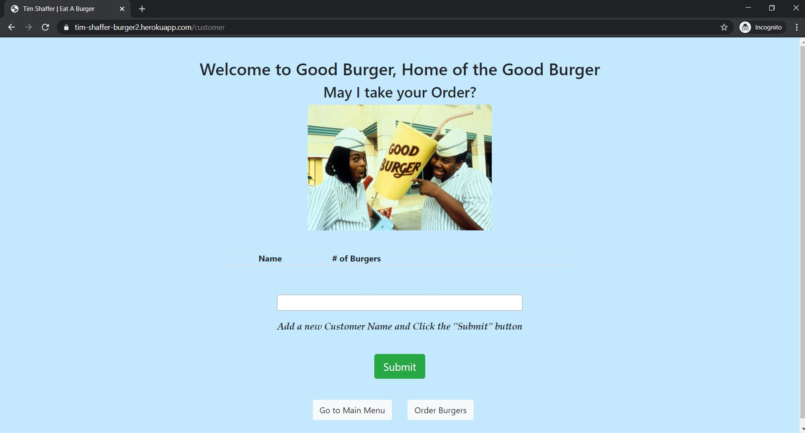
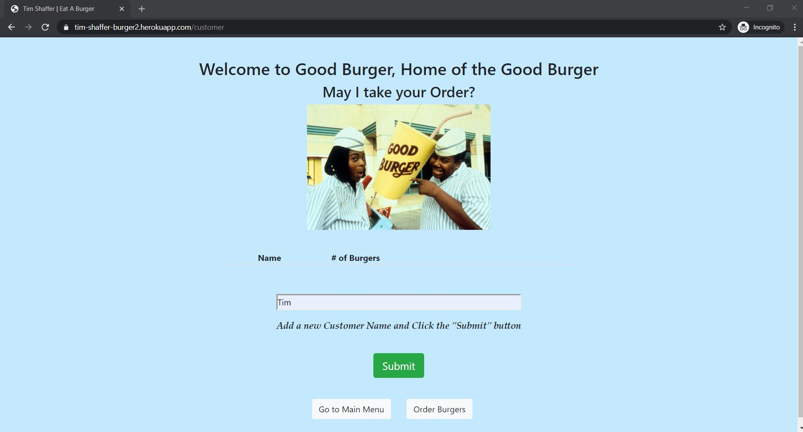

# Sequelized Burger
The purpose of this project was to highlight a Full Stack application setup using the **MVC** design pattern.  

This project updates the **Burger** project to use `sequelize` as well as adding some additional functionality with associating customers to the flow.

* The **MODEL** establishes the the database tables using *Sequelize* via files in the `models` folder.
* The **VIEW** is handled using *Express Handlebars* to present the data from the database based on files in the `views` folder.
* The **CONTROLLER** determines the routing of the information, `GET`, `POST`, or `PUT`, based on the files in the `controllers` folder. 


# Author 
> Tim Shaffer


## Contents
* [Deployment](https://github.com/Tim-Shaffer/sequelizedBurger#deployment)
* [Tech Used](https://github.com/Tim-Shaffer/sequelizedBurger#tech-used)
* [MVC Directory Structure](https://github.com/Tim-Shaffer/sequelizedBurger#mvc-directory-structure)
* [Instructions](https://github.com/Tim-Shaffer/sequelizedBurger#instructions)

# Deployment
The app is deployed to **HEROKU** at the following link:  https://tim-shaffer-burger2.herokuapp.com/

## Tech Used
* JavaScript
    * constructors
* Node.js
    * Express
        * get 
        * post
        * use
        * engine
        * set
        * handlebars
    * mysql
    * sequelize
* HTML 
* CSS
* Bootstrap
* jQuery
* MySQL
    * SQL 
        * CREATE DATABASE
        * USE DATABASE
        * CREATE TABLE
        * INSERT INTO
        * ALTER TABLE
        * SELECT 
        * UPDATE 

### MVC Directory Structure

```bash
├── sequelizedBurger
│   ├── config
│   │   └── config.js
│   ├── controllers
│   │   ├── burgers_controller.js
│   │   └── customers_controller.js
│   ├── db
│   │   └── schema.sql
│   ├── models
│   │   ├── burger.js
│   │   ├── customer.js
│   │   └── index.js
│   ├── public
│   │   └── assets
│   |       ├── css
│   │       |   └── burger_style.css
│   |       ├── img
│   │       |   └── Good_Burger.jpg
│   |       └── js
│   │           ├── burgers.js
│   │           └── customers.js
│   └── views
│       ├─── layouts
│       |       └── main.handlebars
│       ├─── partials
│       |       ├─── burgers
│       |       |    └── burger-block.handlebars
│       |       └─── customers
│       |            └── customer-block.handlebars
|       ├── cust_burger.handlebars
|       ├── customer.handlebars
│       └── index.handlebars
├── .gitignore
├── package.json
├── README.md
└── server.js
```

### Instructions

1. Clicking the **HEROKU** link -  - will take you to the Home Page.

    

1. From the Main Menu you can Mange Customers or Order Burgers.  However, if you try to go to Order Burgers before adding any customers, it will take you to the Manage Customers view instead.

    

1. Add a Customer by entering it into the textbox.

    

1. Click the **Submit** button and the Customer will be added to a Customer table along with # of burgers, a direct link to Order Burgers for that Customer, and a Delete Customer link.

    

