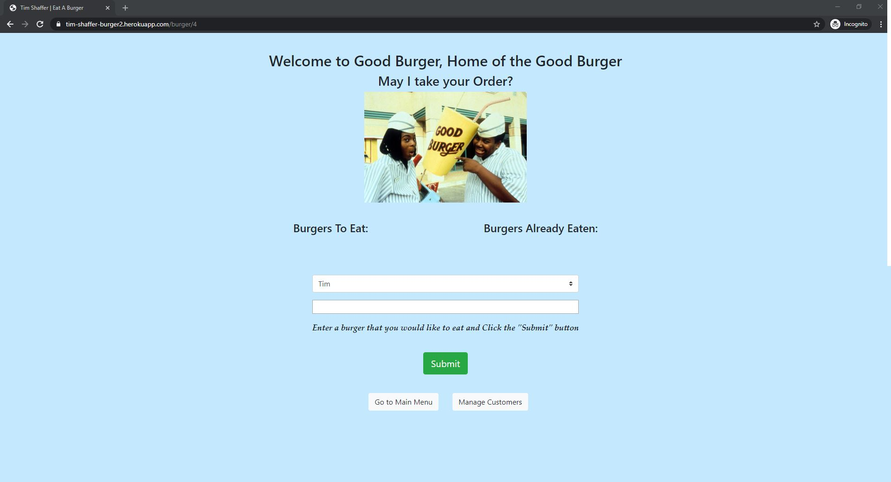

# burger
The purpose of this project was to highlight a Full Stack application setup using the **MVC** design pattern.  

* The **MODEL** establishes the connection to the database using *Object Relational Mapping* via files in the `config` folder.
* The **VIEW** is handled using *Express Handlebars* to present the data from the database based on files in the `views` folder.
* The **CONTROLLER** determines the routing of the information, `GET`, `POST`, or `PUT`, based on the file in the `controllers` folder. 


# Author 
> Tim Shaffer


## Contents
* [Deployment](https://github.com/Tim-Shaffer/burger#deployment)
* [Tech Used](https://github.com/Tim-Shaffer/burger#tech-used)
* [MVC Directory Structure](https://github.com/Tim-Shaffer/burger#mvc-directory-structure)
* [Instructions](https://github.com/Tim-Shaffer/burger#instructions)

# Deployment
The app is deployed to **HEROKU** at the following link:  https://tim-shaffer-burger1.herokuapp.com/

## Tech Used
* JavaScript
    * constructors
* Node.js
    * Express
        * get 
        * post
        * use
        * engine
        * set
        * handlebars
    * mysql
* HTML 
* CSS
* Bootstrap
* jQuery
* MySQL
    * SQL 
        * CREATE DATABASE
        * USE DATABASE
        * CREATE TABLE
        * INSERT INTO
        * ALTER TABLE
        * SELECT 
        * UPDATE 

### MVC Directory Structure

```bash
├── burger
│   ├── config
│   │   ├── connection.js
│   │   └── orm.js
│   ├── controllers
│   │   └── burgers_controller.js
│   ├── db
│   │   ├── schema.sql
│   │   └── seeds.sql
│   ├── models
│   │   └── burger.js
│   ├── public
│   │   └── assets
│   |       ├── css
│   │       |   └── burgers_controller.js
│   |       ├── img
│   │       |   └── Good_Burger.jpg
│   |       └── js
│   │           └── burgers.js
│   └── views
├── .gitignore
├── package.json
├── README.md
└── server.js
```

### Instructions

1. Clicking the **HEROKU** link -  - will take you to the Home Page.

    

1. Add a Burger that you would like to eat by entering it into the textbox.

    

1. Click the **Submit** button and the burger will be added to the Burgers To Eat list with an associated **Devour It!** button.

    

1. Enter more burgers to eat in the same manner.

    
    
1. Click on a particular burgers **Devour It!** button and the burger will be updated as *devoured* and moved to the Burgers Already Eaten list.

    